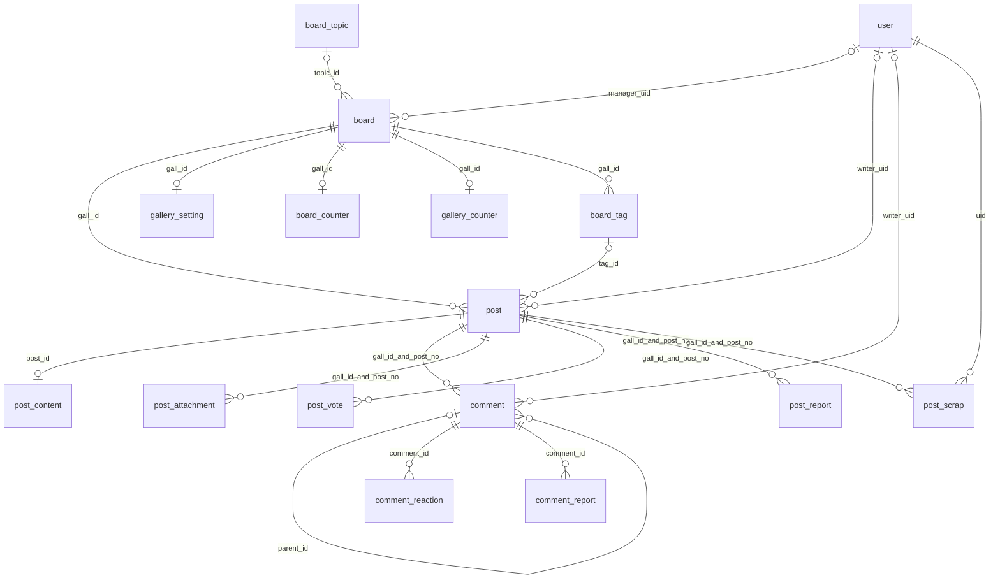
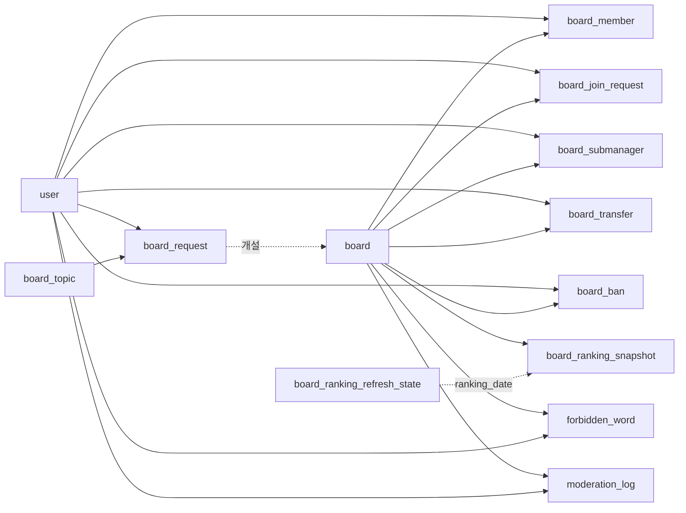
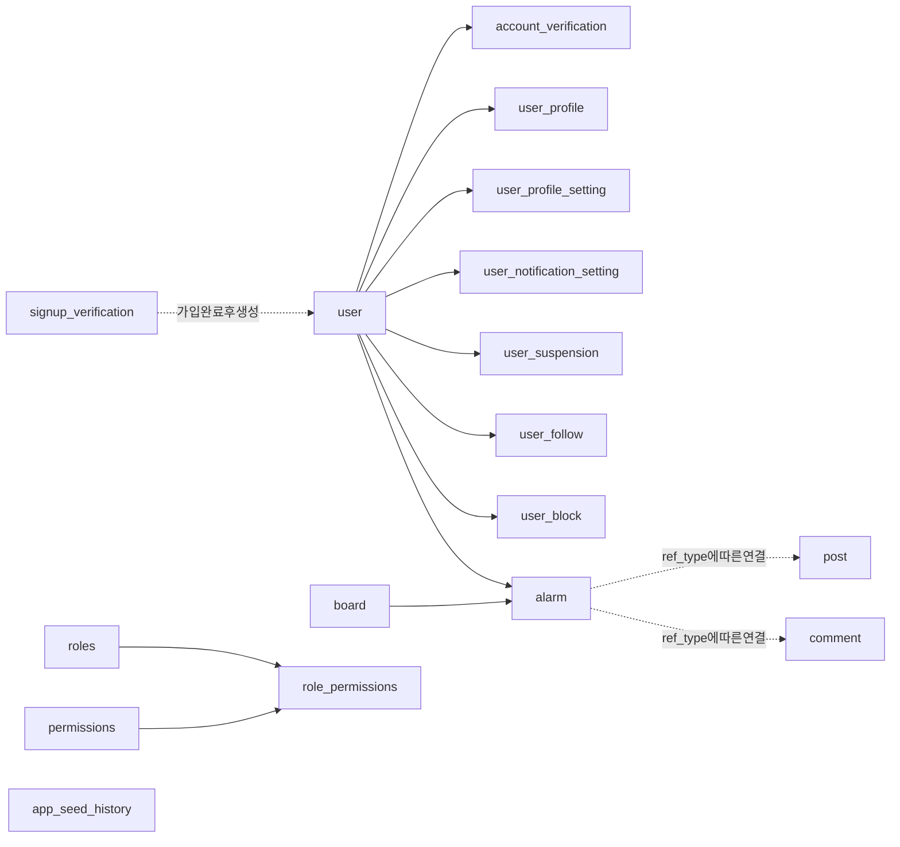

# Irisen 데이터베이스 테이블 관계

기준일: 2026-09-09. 프로젝트의 `mydb.db` 스키마와 `src/main/java`의 스키마 초기화·조회·저장 코드를 대조한 문서입니다. 운영 MySQL에 직접 접속한 결과는 아닙니다. 실제 사용자 데이터는 포함하지 않습니다.

전체 **39개 테이블**을 포함합니다. 아래 FK는 로컬 SQLite에 선언된 외래키이며, 논리 관계는 코드 또는 업무 흐름에서 연결하는 키입니다. FK 선언과 실행 중 외래키 검증 활성화 여부는 별개입니다.

## 읽는 방법

관계 표의 방향은 **참조하는 컬럼 → 대상 컬럼**입니다. 여러 행이 하나의 대상을 참조하는 N:1이 기본이며, 참조 컬럼이 PK/UNIQUE이면 대상당 최대 한 행입니다. NULL 허용 여부는 마지막 컬럼 사전을 확인하세요. Mermaid 그림은 논리 구조를 요약한 것이며, 선 모양이 실제 FK 선언을 의미하지 않습니다.

## 핵심 관계도

`post.id`는 전체 게시글 식별자이고, `post_no`는 보드 내부 번호입니다. 댓글·첨부·신고·스크랩·투표는 `(gall_id, post_no)`로 연결합니다. `post_content`는 `post_id`와 이 복합 식별자를 모두 저장하며 코드에서 두 UNIQUE KEY를 선언합니다. 로컬 SQLite 변환본은 이 UNIQUE KEY를 보존하지 않아, 그림의 본문 0..1 관계는 현재 코드의 의도입니다.

## 보드 운영·회원 관계도

이 그림은 대상에서 연결 테이블로 향합니다. 요청자·검토자·양도인·양수인처럼 동일한 `user`를 여러 역할로 참조하는 상세 컬럼은 아래 표에 모두 구분했습니다.

## 계정·알림·기타 관계도

`user_follow`와 `user_block`은 각각 두 사용자 사이를 연결합니다. `signup_verification.uid`는 가입 예정 ID이므로 기존 `user`의 FK로 취급하지 않습니다. `app_seed_history`는 독립 테이블입니다. `roles`·`permissions`·`role_permissions`는 서로 연결되지만, 현재 계정 권한 판정은 `user.member_division`과 부관리자 권한 컬럼을 사용합니다. `user`와 `roles` 사이의 FK는 없습니다.

## 전체 관계 목록

| 참조 테이블·컬럼 | 대상 테이블·컬럼 | 구분 | 의미·조건 |
|---|---|---|---|
| `account_verification.(uid)` | `user.(uid)` | 논리 | 코드의 조회·저장 관계 |
| `alarm.(ref_gall_id)` | `board.(gall_id)` | FK | 로컬 DB에 선언 |
| `alarm.(uid)` | `user.(uid)` | FK | 로컬 DB에 선언 |
| `board.(manager_uid)` | `user.(uid)` | FK | 로컬 DB에 선언 |
| `board.(topic_id)` | `board_topic.(topic_id)` | 논리 | 주제 분류 |
| `board_ban.(banned_by)` | `user.(uid)` | FK | 로컬 DB에 선언 |
| `board_ban.(gall_id)` | `board.(gall_id)` | FK | 로컬 DB에 선언 |
| `board_ban.(target_uid)` | `user.(uid)` | FK | 로컬 DB에 선언 |
| `board_counter.(gall_id)` | `board.(gall_id)` | 논리 | 보드 식별자 |
| `board_join_request.(gall_id)` | `board.(gall_id)` | 논리 | 보드 식별자 |
| `board_join_request.(reviewed_by)` | `user.(uid)` | 논리 | 코드의 조회·저장 관계 |
| `board_join_request.(uid)` | `user.(uid)` | 논리 | 코드의 조회·저장 관계 |
| `board_member.(approved_by)` | `user.(uid)` | 논리 | 코드의 조회·저장 관계 |
| `board_member.(gall_id)` | `board.(gall_id)` | 논리 | 보드 식별자 |
| `board_member.(uid)` | `user.(uid)` | 논리 | 코드의 조회·저장 관계 |
| `board_ranking_snapshot.(gall_id)` | `board.(gall_id)` | 논리 | 보드 식별자 |
| `board_ranking_snapshot.(ranking_date)` | `board_ranking_refresh_state.(ranking_date)` | 논리 | 같은 날짜의 집계와 갱신 상태; FK 없는 운영상 연결 |
| `board_request.(gall_id)` | `board.(gall_id)` | 논리 | 개설할 보드 ID; 승인 전에는 대상 보드가 없을 수 있음 |
| `board_request.(requester_uid)` | `user.(uid)` | FK | 로컬 DB에 선언 |
| `board_request.(reviewed_by)` | `user.(uid)` | FK | 로컬 DB에 선언 |
| `board_request.(topic_id)` | `board_topic.(topic_id)` | 논리 | 주제 분류 |
| `board_submanager.(appointed_by)` | `user.(uid)` | 논리 | 코드의 조회·저장 관계 |
| `board_submanager.(gall_id)` | `board.(gall_id)` | 논리 | 보드 식별자 |
| `board_submanager.(uid)` | `user.(uid)` | 논리 | 코드의 조회·저장 관계 |
| `board_tag.(gall_id)` | `board.(gall_id)` | FK | 로컬 DB에 선언 |
| `board_transfer.(from_uid)` | `user.(uid)` | FK | 로컬 DB에 선언 |
| `board_transfer.(gall_id)` | `board.(gall_id)` | FK | 로컬 DB에 선언 |
| `board_transfer.(to_uid)` | `user.(uid)` | FK | 로컬 DB에 선언 |
| `comment.(gall_id)` | `board.(gall_id)` | FK | 로컬 DB에 선언 |
| `comment.(gall_id, post_no)` | `post.(gall_id, post_no)` | 논리 | 보드 안에서 게시글 번호를 해석하는 복합 연결 |
| `comment.(parent_id)` | `comment.(id)` | FK | 로컬 DB에 선언 |
| `comment.(writer_uid)` | `user.(uid)` | FK | 로컬 DB에 선언 |
| `comment_reaction.(comment_id)` | `comment.(id)` | 논리 | 코드의 조회·저장 관계 |
| `comment_report.(comment_id)` | `comment.(id)` | 논리 | 코드의 조회·저장 관계 |
| `forbidden_word.(created_by)` | `user.(uid)` | 논리 | 코드의 조회·저장 관계 |
| `forbidden_word.(gall_id)` | `board.(gall_id)` | 논리 | 보드 범위; NULL이면 전역 범위 가능 |
| `gallery_counter.(gall_id)` | `board.(gall_id)` | 논리 | 보드 식별자 |
| `gallery_setting.(gall_id)` | `board.(gall_id)` | FK | 로컬 DB에 선언 |
| `gallery_setting.(updated_by)` | `user.(uid)` | FK | 로컬 DB에 선언 |
| `moderation_log.(actor_uid)` | `user.(uid)` | 논리 | 코드의 조회·저장 관계 |
| `moderation_log.(gall_id)` | `board.(gall_id)` | 논리 | 보드 범위; NULL이면 전역 범위 가능 |
| `moderation_log.(target_uid)` | `user.(uid)` | 논리 | 코드의 조회·저장 관계 |
| `post.(concept_cancelled_by)` | `user.(uid)` | FK | 로컬 DB에 선언 |
| `post.(gall_id)` | `board.(gall_id)` | FK | 로컬 DB에 선언 |
| `post.(tag_id)` | `board_tag.(tag_id)` | FK | 로컬 DB에 선언 |
| `post.(writer_uid)` | `user.(uid)` | FK | 로컬 DB에 선언 |
| `post_attachment.(gall_id, post_no)` | `post.(gall_id, post_no)` | 논리 | 보드 안에서 게시글 번호를 해석하는 복합 연결 |
| `post_content.(gall_id, post_no)` | `post.(gall_id, post_no)` | 논리 | 보드 안에서 게시글 번호를 해석하는 복합 연결 |
| `post_content.(post_id)` | `post.(id)` | 논리 | 현재 코드의 UNIQUE KEY로 본문 0..1건 의도; 로컬 DB에는 해당 UNIQUE 없음 |
| `post_report.(gall_id, post_no)` | `post.(gall_id, post_no)` | 논리 | 보드 안에서 게시글 번호를 해석하는 복합 연결 |
| `post_scrap.(gall_id, post_no)` | `post.(gall_id, post_no)` | 논리 | 보드 안에서 게시글 번호를 해석하는 복합 연결 |
| `post_scrap.(uid)` | `user.(uid)` | 논리 | 코드의 조회·저장 관계 |
| `post_vote.(gall_id, post_no)` | `post.(gall_id, post_no)` | 논리 | 보드 안에서 게시글 번호를 해석하는 복합 연결 |
| `role_permissions.(perm_id)` | `permissions.(perm_id)` | FK | 로컬 DB에 선언 |
| `role_permissions.(role_id)` | `roles.(role_id)` | FK | 로컬 DB에 선언 |
| `user_block.(blocked_uid)` | `user.(uid)` | 논리 | 코드의 조회·저장 관계 |
| `user_block.(blocker_uid)` | `user.(uid)` | 논리 | 코드의 조회·저장 관계 |
| `user_follow.(follower_uid)` | `user.(uid)` | FK | 로컬 DB에 선언 |
| `user_follow.(following_uid)` | `user.(uid)` | FK | 로컬 DB에 선언 |
| `user_notification_setting.(uid)` | `user.(uid)` | 논리 | 코드의 조회·저장 관계 |
| `user_profile.(uid)` | `user.(uid)` | FK | 로컬 DB에 선언 |
| `user_profile_setting.(uid)` | `user.(uid)` | FK | 로컬 DB에 선언 |
| `user_suspension.(suspended_by)` | `user.(uid)` | 논리 | 코드의 조회·저장 관계 |
| `user_suspension.(uid)` | `user.(uid)` | 논리 | 코드의 조회·저장 관계 |

## 일반 외래키로 표현할 수 없는 관계

| 저장 위치 | 해석 |
|---|---|
| `post_vote.actor_key`, `comment_reaction.actor_key`, `post_report.reporter_key`, `comment_report.reporter_key` | `uid:<uid>`이면 사용자, `ip:<ip>`이면 비회원 IP. 문자열 전체를 `user.uid`에 직접 조인하면 안 됩니다. |
| `alarm.ref_type = post / post_comment` | `ref_id`의 `gall_id:post_no`를 분해하여 게시글을 찾습니다. |
| `alarm.ref_type = comment_reply` | `ref_id`는 부모 댓글 ID입니다. |
| `alarm.ref_type = board / board_join` | `ref_id`는 보드 ID입니다. `board_join_request.request_id`가 아닙니다. |
| `alarm.ref_type = board_staff_request / board_open_request` | `ref_id`는 보드 ID입니다. `content` JSON의 `gallId`, `targetUid`, `requesterUid`, 선택적 `transferId`로 추가 맥락을 전달합니다. |
| `board_ban.target_ip`, `moderation_log.target_ip`, 게시글·댓글의 `ip` | IP 문자열에 의한 행위자 정보이며 사용자 테이블 FK가 아닙니다. |

## 스키마와 코드의 차이·해석 주의

- `build_sqlite_from_dump.py`는 MySQL 덤프의 보조 KEY/UNIQUE KEY를 제거합니다. 따라서 로컬 SQLite만으로 운영 DB의 고유성 제약을 단정할 수 없습니다. 기본 테이블의 운영 DDL은 저장소에 없으므로 특히 `post(gall_id, post_no)`와 `user_profile.uid`의 운영 UNIQUE 여부는 여기서 검증하지 못했습니다.
- 현재 코드에서 선언하는 주요 UNIQUE는 `post_content(post_id)`, `post_content(gall_id, post_no)`, `post_vote(gall_id, post_no, actor_key, vote_type, vote_date)`, `post_report(gall_id, post_no, reporter_key)`, `comment_report(comment_id, reporter_key)`, `board_join_request(gall_id, uid, status)`, `board_ranking_snapshot(ranking_date, gall_id)`, `board_topic(topic_name)`, `signup_verification(uid)`, `signup_verification(email)`입니다.
- `board_counter`와 `gallery_counter`가 모두 존재하며 각각 BoardService와 PostService에서 번호를 발급합니다. 동일 테이블의 별칭이 아니며 별도 저장소입니다.
- `post.content`는 기존 본문이고 `post_content.content`가 분리된 본문입니다. PostService가 기존 본문을 이관하며 조회에서 두 저장소를 함께 취급합니다.
- `board_tag`와 `post.tag_id`는 로컬 DB의 FK 구조입니다. 현재 보드 태그 편집은 주로 `gallery_setting.board_tags`, 분류는 `board.topic_id` 및 `post.category`를 사용합니다. 문자열 태그를 `board_tag.tag_id`와 자동으로 같은 것으로 해석하지 않습니다.
- `user_profile`은 기존 테이블로 탈퇴 시 정리 대상이며, 현재 프로필 저장은 `user_profile_setting`을 사용합니다. 두 테이블을 하나로 합치지 않았습니다.
- `account_verification.verification_code`는 로컬 DB에서 `varchar(20)`이지만 현재 초기화 코드는 `VARCHAR(255)`를 선언합니다. `signup_verification.email`도 로컬 `varchar(255)`와 코드 `VARCHAR(191)`이 다릅니다.
- 일부 초기화 로직은 SQLite 실행 시 생략됩니다. 아래 컬럼 사전은 실제 로컬 파일의 스냅샷이며 MySQL 초기화 후 결과를 보장하지 않습니다.
- 논리 관계에 FK나 CASCADE가 자동으로 생기는 것은 아닙니다. 탈퇴 정리는 `UserDAO`의 명시적인 UPDATE/DELETE 흐름을 확인해야 합니다.

## 전체 테이블·컬럼 사전

타입·NULL·기본값·PK는 로컬 DB 기준입니다. PK 숫자는 복합 기본키 내 순서입니다. 연결이 없는 일반 컬럼도 빠짐없이 나열합니다.

| 테이블 | 역할 | 컬럼 수 |
|---|---|---|
| [account_verification](#table-account_verification) | 기존 계정의 변경·탈퇴 등 이메일 인증 요청 | 8 |
| [alarm](#table-alarm) | 사용자 알림과 요청 처리 참조 | 11 |
| [app_seed_history](#table-app_seed_history) | 초기 테스트 데이터 생성 이력 | 5 |
| [board](#table-board) | 보드 기본 정보·관리자·주제·활동 상태 | 11 |
| [board_ban](#table-board_ban) | 보드별 사용자 또는 IP 차단 | 8 |
| [board_counter](#table-board_counter) | BoardService의 보드별 게시글 번호 발급 | 2 |
| [board_join_request](#table-board_join_request) | 보드 가입 신청 및 검토 | 8 |
| [board_member](#table-board_member) | 보드 가입 사용자와 역할 | 6 |
| [board_ranking_refresh_state](#table-board_ranking_refresh_state) | 날짜별 랭킹 갱신 상태 | 3 |
| [board_ranking_snapshot](#table-board_ranking_snapshot) | 날짜별 보드 랭킹 결과 | 10 |
| [board_request](#table-board_request) | 보드 개설 신청 및 심사 | 11 |
| [board_submanager](#table-board_submanager) | 보드 부관리자와 개별 권한 | 21 |
| [board_tag](#table-board_tag) | DB에 남아 있는 보드별 태그 | 5 |
| [board_topic](#table-board_topic) | 보드 주제 분류 | 6 |
| [board_transfer](#table-board_transfer) | 보드 관리자 양도 요청 | 7 |
| [comment](#table-comment) | 댓글 및 계층형 답글 | 16 |
| [comment_reaction](#table-comment_reaction) | 댓글 반응 | 4 |
| [comment_report](#table-comment_report) | 댓글 신고 | 5 |
| [forbidden_word](#table-forbidden_word) | 전체 또는 보드별 금칙어 | 6 |
| [gallery_counter](#table-gallery_counter) | PostService의 보드별 게시글 번호 발급 | 2 |
| [gallery_setting](#table-gallery_setting) | 보드 표시·접근·작성·이미지·가입 정책 | 23 |
| [moderation_log](#table-moderation_log) | 운영 조치 이력 | 8 |
| [permissions](#table-permissions) | DB의 권한 정의 | 3 |
| [post](#table-post) | 게시글 메타데이터와 기존 본문 | 32 |
| [post_attachment](#table-post_attachment) | 게시글 첨부파일 메타데이터 | 7 |
| [post_content](#table-post_content) | 분리된 게시글 본문과 렌더링 정책 | 12 |
| [post_report](#table-post_report) | 게시글 신고 | 6 |
| [post_scrap](#table-post_scrap) | 사용자의 게시글 스크랩 | 4 |
| [post_vote](#table-post_vote) | 게시글 추천·비추천 | 7 |
| [role_permissions](#table-role_permissions) | 역할과 권한의 다대다 연결 | 2 |
| [roles](#table-roles) | DB의 역할 정의 | 3 |
| [signup_verification](#table-signup_verification) | 가입 완료 전 인증 정보 | 9 |
| [user](#table-user) | 사용자 계정과 서비스 역할 | 8 |
| [user_block](#table-user_block) | 사용자 간 차단 | 3 |
| [user_follow](#table-user_follow) | 사용자 간 팔로우 | 3 |
| [user_notification_setting](#table-user_notification_setting) | 사용자별 알림 설정 | 6 |
| [user_profile](#table-user_profile) | 기존 프로필 정보 | 13 |
| [user_profile_setting](#table-user_profile_setting) | 현재 프로필 표시·공개 설정 | 16 |
| [user_suspension](#table-user_suspension) | 사용자 이용 정지 | 5 |

### account_verification

기존 계정의 변경·탈퇴 등 이메일 인증 요청

관련 코드: [AccountVerificationRepository.java](../src/main/java/org/java/spring_04/auth/AccountVerificationRepository.java), [UserDAO.java](../src/main/java/org/java/spring_04/auth/UserDAO.java)

| 컬럼 | 타입 | NULL 허용 | 기본값 | 키·연결 |
|---|---|---|---|---|
| `request_id` | `INTEGER` | 아니요 | — | PK(1) |
| `uid` | `varchar(50)` | 아니요 | — | 논리 → `user.(uid)` |
| `email` | `varchar(191)` | 아니요 | — | — |
| `action_type` | `varchar(30)` | 아니요 | — | — |
| `password_hash` | `varchar(255)` | 예 | `NULL` | — |
| `verification_code` | `varchar(20)` | 아니요 | — | — |
| `expires_at` | `datetime` | 아니요 | — | — |
| `created_at` | `datetime` | 아니요 | `CURRENT_TIMESTAMP` | — |

### alarm

사용자 알림과 요청 처리 참조

관련 코드: [UserDAO.java](../src/main/java/org/java/spring_04/auth/UserDAO.java), [BoardService.java](../src/main/java/org/java/spring_04/board/BoardService.java), [ConsoleCommandRunner.java](../src/main/java/org/java/spring_04/common/ConsoleCommandRunner.java), [FeatureScheduler.java](../src/main/java/org/java/spring_04/feature/FeatureScheduler.java), [FeatureService.java](../src/main/java/org/java/spring_04/feature/FeatureService.java)

| 컬럼 | 타입 | NULL 허용 | 기본값 | 키·연결 |
|---|---|---|---|---|
| `alarm_id` | `INTEGER` | 아니요 | — | PK(1) |
| `uid` | `varchar(50)` | 아니요 | — | FK → `user.(uid)` |
| `alarm_type` | `varchar(50)` | 아니요 | — | — |
| `title` | `varchar(200)` | 아니요 | — | — |
| `content` | `TEXT` | 예 | — | — |
| `ref_type` | `varchar(50)` | 예 | `NULL` | — |
| `ref_id` | `varchar(100)` | 예 | `NULL` | — |
| `ref_gall_id` | `varchar(50)` | 예 | `NULL` | FK → `board.(gall_id)` |
| `is_read` | `tinyint(1)` | 아니요 | `'0'` | — |
| `created_at` | `datetime` | 아니요 | `CURRENT_TIMESTAMP` | — |
| `read_at` | `datetime` | 예 | `NULL` | — |

### app_seed_history

초기 테스트 데이터 생성 이력

관련 코드: [BulkGuestContentSeedRunner.java](../src/main/java/org/java/spring_04/common/BulkGuestContentSeedRunner.java)

| 컬럼 | 타입 | NULL 허용 | 기본값 | 키·연결 |
|---|---|---|---|---|
| `seed_key` | `varchar(120)` | 아니요 | — | PK(1) |
| `post_count` | `INT` | 아니요 | `'0'` | — |
| `comment_count` | `INT` | 아니요 | `'0'` | — |
| `note` | `varchar(255)` | 예 | `NULL` | — |
| `created_at` | `datetime` | 아니요 | `CURRENT_TIMESTAMP` | — |

### board

보드 기본 정보·관리자·주제·활동 상태

관련 코드: [UserDAO.java](../src/main/java/org/java/spring_04/auth/UserDAO.java), [BoardController.java](../src/main/java/org/java/spring_04/board/BoardController.java), [BoardService.java](../src/main/java/org/java/spring_04/board/BoardService.java), [AdminController.java](../src/main/java/org/java/spring_04/common/AdminController.java), [AlarmController.java](../src/main/java/org/java/spring_04/common/AlarmController.java), [BulkGuestContentSeedRunner.java](../src/main/java/org/java/spring_04/common/BulkGuestContentSeedRunner.java), [ConsoleCommandRunner.java](../src/main/java/org/java/spring_04/common/ConsoleCommandRunner.java), [ContentResponsePolicy.java](../src/main/java/org/java/spring_04/common/ContentResponsePolicy.java), [MobileRedirectFilter.java](../src/main/java/org/java/spring_04/common/MobileRedirectFilter.java), [PageController.java](../src/main/java/org/java/spring_04/common/PageController.java), [PageRequestRateLimitFilter.java](../src/main/java/org/java/spring_04/common/PageRequestRateLimitFilter.java), [ServiceRequestLoggingFilter.java](../src/main/java/org/java/spring_04/common/ServiceRequestLoggingFilter.java), [UploadController.java](../src/main/java/org/java/spring_04/common/UploadController.java), [FeatureController.java](../src/main/java/org/java/spring_04/feature/FeatureController.java), [FeatureService.java](../src/main/java/org/java/spring_04/feature/FeatureService.java), [PostController.java](../src/main/java/org/java/spring_04/post/PostController.java), [PostPageController.java](../src/main/java/org/java/spring_04/post/PostPageController.java), [PostService.java](../src/main/java/org/java/spring_04/post/PostService.java), [ProfileService.java](../src/main/java/org/java/spring_04/profile/ProfileService.java)

| 컬럼 | 타입 | NULL 허용 | 기본값 | 키·연결 |
|---|---|---|---|---|
| `gall_id` | `varchar(50)` | 아니요 | — | PK(1) |
| `gall_name` | `varchar(100)` | 아니요 | — | — |
| `gall_type` | `varchar(10)` | 예 | `NULL` | — |
| `category` | `varchar(50)` | 예 | `NULL` | — |
| `manager_uid` | `varchar(50)` | 예 | `NULL` | FK → `user.(uid)` |
| `post_count` | `INT` | 예 | `'0'` | — |
| `status` | `varchar(20)` | 아니요 | `'active'` | — |
| `last_activity_at` | `datetime` | 예 | `NULL` | — |
| `dormant_notified_at` | `datetime` | 예 | `NULL` | — |
| `dormant_at` | `datetime` | 예 | `NULL` | — |
| `topic_id` | `varchar(50)` | 예 | `NULL` | 논리 → `board_topic.(topic_id)` |

### board_ban

보드별 사용자 또는 IP 차단

관련 코드: [UserDAO.java](../src/main/java/org/java/spring_04/auth/UserDAO.java), [BoardService.java](../src/main/java/org/java/spring_04/board/BoardService.java), [FeatureService.java](../src/main/java/org/java/spring_04/feature/FeatureService.java)

| 컬럼 | 타입 | NULL 허용 | 기본값 | 키·연결 |
|---|---|---|---|---|
| `ban_id` | `INTEGER` | 아니요 | — | PK(1) |
| `gall_id` | `varchar(50)` | 아니요 | — | FK → `board.(gall_id)` |
| `target_uid` | `varchar(50)` | 예 | `NULL` | FK → `user.(uid)` |
| `target_ip` | `varchar(45)` | 예 | `NULL` | — |
| `banned_by` | `varchar(50)` | 아니요 | — | FK → `user.(uid)` |
| `reason` | `varchar(255)` | 예 | `NULL` | — |
| `banned_at` | `datetime` | 아니요 | `CURRENT_TIMESTAMP` | — |
| `expires_at` | `datetime` | 예 | `NULL` | — |

### board_counter

BoardService의 보드별 게시글 번호 발급

관련 코드: [BoardService.java](../src/main/java/org/java/spring_04/board/BoardService.java)

| 컬럼 | 타입 | NULL 허용 | 기본값 | 키·연결 |
|---|---|---|---|---|
| `gall_id` | `varchar(50)` | 아니요 | — | PK(1); 논리 → `board.(gall_id)` |
| `last_post_no` | `INT` | 아니요 | `'0'` | — |

### board_join_request

보드 가입 신청 및 검토

관련 코드: [UserDAO.java](../src/main/java/org/java/spring_04/auth/UserDAO.java), [FeatureService.java](../src/main/java/org/java/spring_04/feature/FeatureService.java)

| 컬럼 | 타입 | NULL 허용 | 기본값 | 키·연결 |
|---|---|---|---|---|
| `request_id` | `INTEGER` | 아니요 | — | PK(1) |
| `gall_id` | `varchar(50)` | 아니요 | — | 논리 → `board.(gall_id)` |
| `uid` | `varchar(50)` | 아니요 | — | 논리 → `user.(uid)` |
| `status` | `varchar(20)` | 아니요 | `'pending'` | — |
| `reason` | `TEXT` | 예 | — | — |
| `reviewed_by` | `varchar(50)` | 예 | `NULL` | 논리 → `user.(uid)` |
| `reviewed_at` | `datetime` | 예 | `NULL` | — |
| `created_at` | `datetime` | 아니요 | `CURRENT_TIMESTAMP` | — |

### board_member

보드 가입 사용자와 역할

관련 코드: [UserDAO.java](../src/main/java/org/java/spring_04/auth/UserDAO.java), [FeatureService.java](../src/main/java/org/java/spring_04/feature/FeatureService.java)

| 컬럼 | 타입 | NULL 허용 | 기본값 | 키·연결 |
|---|---|---|---|---|
| `gall_id` | `varchar(50)` | 아니요 | — | PK(1); 논리 → `board.(gall_id)` |
| `uid` | `varchar(50)` | 아니요 | — | PK(2); 논리 → `user.(uid)` |
| `member_role` | `varchar(30)` | 아니요 | `'member'` | — |
| `status` | `varchar(20)` | 아니요 | `'active'` | — |
| `joined_at` | `datetime` | 아니요 | `CURRENT_TIMESTAMP` | — |
| `approved_by` | `varchar(50)` | 예 | `NULL` | 논리 → `user.(uid)` |

### board_ranking_refresh_state

날짜별 랭킹 갱신 상태

관련 코드: [BoardService.java](../src/main/java/org/java/spring_04/board/BoardService.java)

| 컬럼 | 타입 | NULL 허용 | 기본값 | 키·연결 |
|---|---|---|---|---|
| `ranking_date` | `date` | 아니요 | — | PK(1) |
| `refresh_count` | `INT` | 아니요 | `'0'` | — |
| `last_refreshed_at` | `datetime` | 예 | `NULL` | — |

### board_ranking_snapshot

날짜별 보드 랭킹 결과

관련 코드: [BoardService.java](../src/main/java/org/java/spring_04/board/BoardService.java)

| 컬럼 | 타입 | NULL 허용 | 기본값 | 키·연결 |
|---|---|---|---|---|
| `ranking_date` | `date` | 아니요 | — | PK(1); 논리 → `board_ranking_refresh_state.(ranking_date)` |
| `rank_no` | `INT` | 아니요 | — | PK(2) |
| `gall_id` | `varchar(50)` | 아니요 | — | 논리 → `board.(gall_id)` |
| `gall_name` | `varchar(100)` | 아니요 | — | — |
| `gall_type` | `varchar(10)` | 예 | `NULL` | — |
| `score` | `bigint` | 아니요 | `'0'` | — |
| `post_count` | `INT` | 아니요 | `'0'` | — |
| `recent_post_count` | `INT` | 아니요 | `'0'` | — |
| `recent_recommend_sum` | `INT` | 아니요 | `'0'` | — |
| `refreshed_at` | `datetime` | 아니요 | `CURRENT_TIMESTAMP` | — |

### board_request

보드 개설 신청 및 심사

관련 코드: [UserDAO.java](../src/main/java/org/java/spring_04/auth/UserDAO.java), [BoardService.java](../src/main/java/org/java/spring_04/board/BoardService.java)

| 컬럼 | 타입 | NULL 허용 | 기본값 | 키·연결 |
|---|---|---|---|---|
| `request_id` | `INTEGER` | 아니요 | — | PK(1) |
| `requester_uid` | `varchar(50)` | 아니요 | — | FK → `user.(uid)` |
| `gall_id` | `varchar(50)` | 예 | `NULL` | 논리 → `board.(gall_id)` |
| `gall_name` | `varchar(100)` | 아니요 | — | — |
| `gall_type` | `varchar(10)` | 아니요 | `'m'` | — |
| `reason` | `TEXT` | 예 | — | — |
| `status` | `varchar(20)` | 아니요 | `'pending'` | — |
| `reviewed_by` | `varchar(50)` | 예 | `NULL` | FK → `user.(uid)` |
| `reviewed_at` | `datetime` | 예 | `NULL` | — |
| `created_at` | `datetime` | 아니요 | `CURRENT_TIMESTAMP` | — |
| `topic_id` | `varchar(50)` | 예 | `NULL` | 논리 → `board_topic.(topic_id)` |

### board_submanager

보드 부관리자와 개별 권한

관련 코드: [UserDAO.java](../src/main/java/org/java/spring_04/auth/UserDAO.java), [BoardService.java](../src/main/java/org/java/spring_04/board/BoardService.java), [FeatureService.java](../src/main/java/org/java/spring_04/feature/FeatureService.java), [PostService.java](../src/main/java/org/java/spring_04/post/PostService.java), [ProfileService.java](../src/main/java/org/java/spring_04/profile/ProfileService.java)

| 컬럼 | 타입 | NULL 허용 | 기본값 | 키·연결 |
|---|---|---|---|---|
| `gall_id` | `varchar(50)` | 아니요 | — | PK(1); 논리 → `board.(gall_id)` |
| `uid` | `varchar(50)` | 아니요 | — | PK(2); 논리 → `user.(uid)` |
| `appointed_by` | `varchar(50)` | 예 | `NULL` | 논리 → `user.(uid)` |
| `status` | `varchar(20)` | 아니요 | `'pending'` | — |
| `responded_at` | `datetime` | 예 | `NULL` | — |
| `created_at` | `datetime` | 아니요 | `CURRENT_TIMESTAMP` | — |
| `can_delete_post` | `tinyint(1)` | 아니요 | `'1'` | — |
| `can_delete_comment` | `tinyint(1)` | 아니요 | `'1'` | — |
| `can_manage_write` | `tinyint(1)` | 아니요 | `'1'` | — |
| `can_manage_guest_penalty` | `tinyint(1)` | 아니요 | `'1'` | — |
| `can_manage_tags` | `tinyint(1)` | 아니요 | `'1'` | — |
| `can_manage_images` | `tinyint(1)` | 아니요 | `'1'` | — |
| `can_manage_notice` | `tinyint(1)` | 아니요 | `'1'` | — |
| `can_manage_categories` | `tinyint(1)` | 아니요 | `'1'` | — |
| `can_manage_cover` | `tinyint(1)` | 아니요 | `'1'` | — |
| `can_ban_user` | `tinyint(1)` | 아니요 | `'1'` | — |
| `can_manage_forbidden_word` | `tinyint(1)` | 아니요 | `'1'` | — |
| `can_bump_post` | `tinyint(1)` | 아니요 | `'1'` | — |
| `can_manage_concept` | `tinyint(1)` | 아니요 | `'1'` | — |
| `can_manage_concept_cut` | `tinyint(1)` | 아니요 | `'1'` | — |
| `can_manage_submanager` | `tinyint(1)` | 아니요 | `'0'` | — |

### board_tag

DB에 남아 있는 보드별 태그

| 컬럼 | 타입 | NULL 허용 | 기본값 | 키·연결 |
|---|---|---|---|---|
| `tag_id` | `INTEGER` | 아니요 | — | PK(1) |
| `gall_id` | `varchar(50)` | 아니요 | — | FK → `board.(gall_id)` |
| `tag_name` | `varchar(50)` | 아니요 | — | — |
| `sort_order` | `INT` | 아니요 | `'0'` | — |
| `created_at` | `datetime` | 아니요 | `CURRENT_TIMESTAMP` | — |

### board_topic

보드 주제 분류

관련 코드: [BoardService.java](../src/main/java/org/java/spring_04/board/BoardService.java)

| 컬럼 | 타입 | NULL 허용 | 기본값 | 키·연결 |
|---|---|---|---|---|
| `topic_id` | `varchar(50)` | 아니요 | — | PK(1) |
| `topic_name` | `varchar(100)` | 아니요 | — | — |
| `description` | `varchar(255)` | 예 | `NULL` | — |
| `sort_order` | `INT` | 아니요 | `'0'` | — |
| `is_active` | `tinyint(1)` | 아니요 | `'1'` | — |
| `created_at` | `datetime` | 아니요 | `CURRENT_TIMESTAMP` | — |

### board_transfer

보드 관리자 양도 요청

관련 코드: [UserDAO.java](../src/main/java/org/java/spring_04/auth/UserDAO.java), [BoardService.java](../src/main/java/org/java/spring_04/board/BoardService.java)

| 컬럼 | 타입 | NULL 허용 | 기본값 | 키·연결 |
|---|---|---|---|---|
| `transfer_id` | `INTEGER` | 아니요 | — | PK(1) |
| `gall_id` | `varchar(50)` | 아니요 | — | FK → `board.(gall_id)` |
| `from_uid` | `varchar(50)` | 아니요 | — | FK → `user.(uid)` |
| `to_uid` | `varchar(50)` | 아니요 | — | FK → `user.(uid)` |
| `status` | `varchar(20)` | 아니요 | `'pending'` | — |
| `responded_at` | `datetime` | 예 | `NULL` | — |
| `created_at` | `datetime` | 아니요 | `CURRENT_TIMESTAMP` | — |

### comment

댓글 및 계층형 답글

관련 코드: [UserDAO.java](../src/main/java/org/java/spring_04/auth/UserDAO.java), [BoardService.java](../src/main/java/org/java/spring_04/board/BoardService.java), [BulkGuestContentSeedRunner.java](../src/main/java/org/java/spring_04/common/BulkGuestContentSeedRunner.java), [ConsoleCommandRunner.java](../src/main/java/org/java/spring_04/common/ConsoleCommandRunner.java), [FeatureService.java](../src/main/java/org/java/spring_04/feature/FeatureService.java), [PostController.java](../src/main/java/org/java/spring_04/post/PostController.java), [PostPageController.java](../src/main/java/org/java/spring_04/post/PostPageController.java), [PostService.java](../src/main/java/org/java/spring_04/post/PostService.java), [ProfileService.java](../src/main/java/org/java/spring_04/profile/ProfileService.java)

| 컬럼 | 타입 | NULL 허용 | 기본값 | 키·연결 |
|---|---|---|---|---|
| `id` | `INTEGER` | 아니요 | — | PK(1) |
| `gall_id` | `varchar(50)` | 아니요 | — | FK → `board.(gall_id)`; 논리 → `post.(gall_id, post_no)` |
| `post_no` | `INT` | 아니요 | — | 논리 → `post.(gall_id, post_no)` |
| `parent_id` | `INT` | 예 | `NULL` | FK → `comment.(id)` |
| `writer_uid` | `varchar(50)` | 예 | `NULL` | FK → `user.(uid)` |
| `name` | `varchar(50)` | 아니요 | — | — |
| `ip` | `varchar(45)` | 예 | `NULL` | — |
| `password` | `varchar(255)` | 예 | `NULL` | — |
| `content` | `TEXT` | 아니요 | — | — |
| `is_deleted` | `tinyint(1)` | 아니요 | `'0'` | — |
| `created_at` | `datetime` | 아니요 | `CURRENT_TIMESTAMP` | — |
| `reply_depth` | `INT` | 아니요 | `'0'` | — |
| `sort_key` | `varchar(255)` | 예 | `NULL` | — |
| `like_count` | `INT` | 아니요 | `'0'` | — |
| `report_count` | `INT` | 아니요 | `'0'` | — |
| `review_status` | `varchar(20)` | 아니요 | `'normal'` | — |

### comment_reaction

댓글 반응

관련 코드: [UserDAO.java](../src/main/java/org/java/spring_04/auth/UserDAO.java), [FeatureService.java](../src/main/java/org/java/spring_04/feature/FeatureService.java)

| 컬럼 | 타입 | NULL 허용 | 기본값 | 키·연결 |
|---|---|---|---|---|
| `comment_id` | `bigint` | 아니요 | — | PK(1); 논리 → `comment.(id)` |
| `actor_key` | `varchar(150)` | 아니요 | — | PK(2) |
| `reaction_type` | `varchar(20)` | 아니요 | `'like'` | — |
| `created_at` | `datetime` | 아니요 | `CURRENT_TIMESTAMP` | — |

### comment_report

댓글 신고

관련 코드: [UserDAO.java](../src/main/java/org/java/spring_04/auth/UserDAO.java), [FeatureService.java](../src/main/java/org/java/spring_04/feature/FeatureService.java)

| 컬럼 | 타입 | NULL 허용 | 기본값 | 키·연결 |
|---|---|---|---|---|
| `report_id` | `INTEGER` | 아니요 | — | PK(1) |
| `comment_id` | `bigint` | 아니요 | — | 논리 → `comment.(id)` |
| `reporter_key` | `varchar(150)` | 아니요 | — | — |
| `reason` | `varchar(255)` | 예 | `NULL` | — |
| `created_at` | `datetime` | 아니요 | `CURRENT_TIMESTAMP` | — |

### forbidden_word

전체 또는 보드별 금칙어

관련 코드: [UserDAO.java](../src/main/java/org/java/spring_04/auth/UserDAO.java), [FeatureService.java](../src/main/java/org/java/spring_04/feature/FeatureService.java)

| 컬럼 | 타입 | NULL 허용 | 기본값 | 키·연결 |
|---|---|---|---|---|
| `word_id` | `INTEGER` | 아니요 | — | PK(1) |
| `gall_id` | `varchar(50)` | 예 | `NULL` | 논리 → `board.(gall_id)` |
| `word` | `varchar(100)` | 아니요 | — | — |
| `action` | `varchar(20)` | 아니요 | `'block'` | — |
| `created_by` | `varchar(50)` | 예 | `NULL` | 논리 → `user.(uid)` |
| `created_at` | `datetime` | 아니요 | `CURRENT_TIMESTAMP` | — |

### gallery_counter

PostService의 보드별 게시글 번호 발급

관련 코드: [BulkGuestContentSeedRunner.java](../src/main/java/org/java/spring_04/common/BulkGuestContentSeedRunner.java), [PostService.java](../src/main/java/org/java/spring_04/post/PostService.java)

| 컬럼 | 타입 | NULL 허용 | 기본값 | 키·연결 |
|---|---|---|---|---|
| `gall_id` | `varchar(50)` | 아니요 | — | PK(1); 논리 → `board.(gall_id)` |
| `last_post_no` | `INT` | 아니요 | `'0'` | — |

### gallery_setting

보드 표시·접근·작성·이미지·가입 정책

관련 코드: [UserDAO.java](../src/main/java/org/java/spring_04/auth/UserDAO.java), [BoardService.java](../src/main/java/org/java/spring_04/board/BoardService.java), [FeatureService.java](../src/main/java/org/java/spring_04/feature/FeatureService.java), [PostService.java](../src/main/java/org/java/spring_04/post/PostService.java)

| 컬럼 | 타입 | NULL 허용 | 기본값 | 키·연결 |
|---|---|---|---|---|
| `gall_id` | `varchar(50)` | 아니요 | — | PK(1); FK → `board.(gall_id)` |
| `board_notice` | `TEXT` | 예 | — | — |
| `welcome_message` | `TEXT` | 예 | — | — |
| `welcome_image_url` | `varchar(500)` | 예 | `NULL` | — |
| `theme_color` | `varchar(20)` | 아니요 | `'#ff8fab'` | — |
| `allow_guest_post` | `tinyint(1)` | 아니요 | `'1'` | — |
| `allow_guest_comment` | `tinyint(1)` | 아니요 | `'1'` | — |
| `concept_recommend_threshold` | `INT` | 아니요 | `'10'` | — |
| `updated_by` | `varchar(50)` | 예 | `NULL` | FK → `user.(uid)` |
| `updated_at` | `datetime` | 아니요 | `CURRENT_TIMESTAMP` | — |
| `category_options` | `TEXT` | 예 | — | — |
| `join_policy` | `varchar(20)` | 아니요 | `'free'` | — |
| `visibility` | `varchar(20)` | 아니요 | `'public'` | — |
| `pinned_notice_count` | `INT` | 아니요 | `'3'` | — |
| `allowed_attachment_types` | `varchar(255)` | 예 | `NULL` | — |
| `attachment_max_bytes` | `bigint` | 아니요 | `'10485760'` | — |
| `side_board_approval_policy` | `varchar(20)` | 아니요 | `'operator'` | — |
| `dormant_after_days` | `INT` | 아니요 | `'180'` | — |
| `cover_image_url` | `varchar(500)` | 예 | `NULL` | — |
| `allow_member_image` | `tinyint(1)` | 아니요 | `'1'` | — |
| `allow_guest_image` | `tinyint(1)` | 아니요 | `'0'` | — |
| `board_tags` | `TEXT` | 예 | — | — |
| `read_visibility` | `varchar(20)` | 아니요 | `'inherit'` | — |

### moderation_log

운영 조치 이력

관련 코드: [UserDAO.java](../src/main/java/org/java/spring_04/auth/UserDAO.java), [FeatureService.java](../src/main/java/org/java/spring_04/feature/FeatureService.java)

| 컬럼 | 타입 | NULL 허용 | 기본값 | 키·연결 |
|---|---|---|---|---|
| `log_id` | `INTEGER` | 아니요 | — | PK(1) |
| `gall_id` | `varchar(50)` | 예 | `NULL` | 논리 → `board.(gall_id)` |
| `actor_uid` | `varchar(50)` | 예 | `NULL` | 논리 → `user.(uid)` |
| `target_uid` | `varchar(50)` | 예 | `NULL` | 논리 → `user.(uid)` |
| `target_ip` | `varchar(45)` | 예 | `NULL` | — |
| `action_type` | `varchar(50)` | 아니요 | — | — |
| `reason` | `varchar(255)` | 예 | `NULL` | — |
| `created_at` | `datetime` | 아니요 | `CURRENT_TIMESTAMP` | — |

### permissions

DB의 권한 정의

관련 코드: [BoardController.java](../src/main/java/org/java/spring_04/board/BoardController.java), [BoardService.java](../src/main/java/org/java/spring_04/board/BoardService.java), [AdminController.java](../src/main/java/org/java/spring_04/common/AdminController.java)

| 컬럼 | 타입 | NULL 허용 | 기본값 | 키·연결 |
|---|---|---|---|---|
| `perm_id` | `INTEGER` | 아니요 | — | PK(1) |
| `perm_name` | `varchar(50)` | 아니요 | — | — |
| `description` | `varchar(255)` | 예 | `NULL` | — |

### post

게시글 메타데이터와 기존 본문

관련 코드: [UserDAO.java](../src/main/java/org/java/spring_04/auth/UserDAO.java), [BoardController.java](../src/main/java/org/java/spring_04/board/BoardController.java), [BoardService.java](../src/main/java/org/java/spring_04/board/BoardService.java), [BulkGuestContentSeedRunner.java](../src/main/java/org/java/spring_04/common/BulkGuestContentSeedRunner.java), [ConsoleCommandRunner.java](../src/main/java/org/java/spring_04/common/ConsoleCommandRunner.java), [PageController.java](../src/main/java/org/java/spring_04/common/PageController.java), [FeatureService.java](../src/main/java/org/java/spring_04/feature/FeatureService.java), [PostController.java](../src/main/java/org/java/spring_04/post/PostController.java), [PostPageController.java](../src/main/java/org/java/spring_04/post/PostPageController.java), [PostService.java](../src/main/java/org/java/spring_04/post/PostService.java), [ProfileService.java](../src/main/java/org/java/spring_04/profile/ProfileService.java)

| 컬럼 | 타입 | NULL 허용 | 기본값 | 키·연결 |
|---|---|---|---|---|
| `id` | `INTEGER` | 아니요 | — | PK(1) |
| `gall_id` | `varchar(50)` | 아니요 | — | FK → `board.(gall_id)` |
| `post_no` | `INT` | 아니요 | — | — |
| `tag_id` | `INT` | 예 | `NULL` | FK → `board_tag.(tag_id)` |
| `title` | `varchar(255)` | 아니요 | — | — |
| `content` | `TEXT` | 예 | — | — |
| `writer_uid` | `varchar(50)` | 예 | `NULL` | FK → `user.(uid)` |
| `name` | `varchar(50)` | 아니요 | — | — |
| `ip` | `varchar(45)` | 예 | `NULL` | — |
| `password` | `varchar(255)` | 예 | `NULL` | — |
| `view_count` | `INT` | 예 | `'0'` | — |
| `comment_count` | `INT` | 예 | `'0'` | — |
| `recommend_count` | `INT` | 예 | `'0'` | — |
| `unrecommend_count` | `INT` | 예 | `'0'` | — |
| `is_concept` | `tinyint(1)` | 아니요 | `'0'` | — |
| `concept_at` | `datetime` | 예 | `NULL` | — |
| `concept_cancelled_by` | `varchar(50)` | 예 | `NULL` | FK → `user.(uid)` |
| `concept_cancelled_at` | `datetime` | 예 | `NULL` | — |
| `is_deleted` | `tinyint(1)` | 아니요 | `'0'` | — |
| `writed_at` | `datetime` | 예 | `CURRENT_TIMESTAMP` | — |
| `category` | `varchar(50)` | 예 | `NULL` | — |
| `is_draft` | `tinyint(1)` | 아니요 | `'0'` | — |
| `is_secret` | `tinyint(1)` | 아니요 | `'0'` | — |
| `review_status` | `varchar(20)` | 아니요 | `'normal'` | — |
| `report_count` | `INT` | 아니요 | `'0'` | — |
| `pinned_at` | `datetime` | 예 | `NULL` | — |
| `pin_order` | `INT` | 예 | `NULL` | — |
| `attachment_urls` | `TEXT` | 예 | — | — |
| `is_notice` | `tinyint(1)` | 아니요 | `'0'` | — |
| `concept_target_count` | `INT` | 예 | `NULL` | — |
| `concept_manual_state` | `varchar(20)` | 아니요 | `'auto'` | — |
| `bumped_at` | `datetime` | 예 | `NULL` | — |

### post_attachment

게시글 첨부파일 메타데이터

관련 코드: [FeatureService.java](../src/main/java/org/java/spring_04/feature/FeatureService.java)

| 컬럼 | 타입 | NULL 허용 | 기본값 | 키·연결 |
|---|---|---|---|---|
| `attachment_id` | `INTEGER` | 아니요 | — | PK(1) |
| `gall_id` | `varchar(50)` | 아니요 | — | 논리 → `post.(gall_id, post_no)` |
| `post_no` | `bigint` | 아니요 | — | 논리 → `post.(gall_id, post_no)` |
| `url` | `varchar(1000)` | 아니요 | — | — |
| `file_type` | `varchar(100)` | 예 | `NULL` | — |
| `file_size` | `bigint` | 예 | `NULL` | — |
| `created_at` | `datetime` | 아니요 | `CURRENT_TIMESTAMP` | — |

### post_content

분리된 게시글 본문과 렌더링 정책

관련 코드: [BoardService.java](../src/main/java/org/java/spring_04/board/BoardService.java), [PostService.java](../src/main/java/org/java/spring_04/post/PostService.java)

| 컬럼 | 타입 | NULL 허용 | 기본값 | 키·연결 |
|---|---|---|---|---|
| `id` | `INTEGER` | 아니요 | — | PK(1) |
| `post_id` | `bigint` | 아니요 | — | 논리 → `post.(id)` |
| `gall_id` | `varchar(50)` | 아니요 | — | 논리 → `post.(gall_id, post_no)` |
| `post_no` | `bigint` | 아니요 | — | 논리 → `post.(gall_id, post_no)` |
| `content` | `mediumtext` | 예 | — | — |
| `content_format` | `varchar(30)` | 아니요 | `'html'` | — |
| `render_policy` | `varchar(30)` | 아니요 | `'trusted_html'` | — |
| `allow_images` | `tinyint(1)` | 아니요 | `'1'` | — |
| `image_count` | `INT` | 아니요 | `'0'` | — |
| `word_count` | `INT` | 아니요 | `'0'` | — |
| `updated_at` | `datetime` | 아니요 | `CURRENT_TIMESTAMP` | — |
| `created_at` | `datetime` | 아니요 | `CURRENT_TIMESTAMP` | — |

### post_report

게시글 신고

관련 코드: [UserDAO.java](../src/main/java/org/java/spring_04/auth/UserDAO.java), [FeatureService.java](../src/main/java/org/java/spring_04/feature/FeatureService.java)

| 컬럼 | 타입 | NULL 허용 | 기본값 | 키·연결 |
|---|---|---|---|---|
| `report_id` | `INTEGER` | 아니요 | — | PK(1) |
| `gall_id` | `varchar(50)` | 아니요 | — | 논리 → `post.(gall_id, post_no)` |
| `post_no` | `bigint` | 아니요 | — | 논리 → `post.(gall_id, post_no)` |
| `reporter_key` | `varchar(150)` | 아니요 | — | — |
| `reason` | `varchar(255)` | 예 | `NULL` | — |
| `created_at` | `datetime` | 아니요 | `CURRENT_TIMESTAMP` | — |

### post_scrap

사용자의 게시글 스크랩

관련 코드: [UserDAO.java](../src/main/java/org/java/spring_04/auth/UserDAO.java), [FeatureService.java](../src/main/java/org/java/spring_04/feature/FeatureService.java), [ProfileService.java](../src/main/java/org/java/spring_04/profile/ProfileService.java)

| 컬럼 | 타입 | NULL 허용 | 기본값 | 키·연결 |
|---|---|---|---|---|
| `uid` | `varchar(50)` | 아니요 | — | PK(1); 논리 → `user.(uid)` |
| `gall_id` | `varchar(50)` | 아니요 | — | PK(2); 논리 → `post.(gall_id, post_no)` |
| `post_no` | `bigint` | 아니요 | — | PK(3); 논리 → `post.(gall_id, post_no)` |
| `created_at` | `datetime` | 아니요 | `CURRENT_TIMESTAMP` | — |

### post_vote

게시글 추천·비추천

관련 코드: [UserDAO.java](../src/main/java/org/java/spring_04/auth/UserDAO.java), [PostService.java](../src/main/java/org/java/spring_04/post/PostService.java)

| 컬럼 | 타입 | NULL 허용 | 기본값 | 키·연결 |
|---|---|---|---|---|
| `id` | `INTEGER` | 아니요 | — | PK(1) |
| `gall_id` | `varchar(50)` | 아니요 | — | 논리 → `post.(gall_id, post_no)` |
| `post_no` | `bigint` | 아니요 | — | 논리 → `post.(gall_id, post_no)` |
| `actor_key` | `varchar(150)` | 아니요 | — | — |
| `vote_type` | `varchar(20)` | 아니요 | — | — |
| `vote_date` | `date` | 아니요 | — | — |
| `created_at` | `datetime` | 아니요 | `CURRENT_TIMESTAMP` | — |

### role_permissions

역할과 권한의 다대다 연결

| 컬럼 | 타입 | NULL 허용 | 기본값 | 키·연결 |
|---|---|---|---|---|
| `role_id` | `INT` | 아니요 | — | PK(1); FK → `roles.(role_id)` |
| `perm_id` | `INT` | 아니요 | — | PK(2); FK → `permissions.(perm_id)` |

### roles

DB의 역할 정의

관련 코드: [AdminController.java](../src/main/java/org/java/spring_04/common/AdminController.java)

| 컬럼 | 타입 | NULL 허용 | 기본값 | 키·연결 |
|---|---|---|---|---|
| `role_id` | `INTEGER` | 아니요 | — | PK(1) |
| `role_name` | `varchar(50)` | 아니요 | — | — |
| `description` | `varchar(255)` | 예 | `NULL` | — |

### signup_verification

가입 완료 전 인증 정보

관련 코드: [SignupVerificationRepository.java](../src/main/java/org/java/spring_04/auth/SignupVerificationRepository.java), [UserDAO.java](../src/main/java/org/java/spring_04/auth/UserDAO.java)

| 컬럼 | 타입 | NULL 허용 | 기본값 | 키·연결 |
|---|---|---|---|---|
| `request_id` | `INTEGER` | 아니요 | — | PK(1) |
| `uid` | `varchar(50)` | 아니요 | — | — |
| `nick` | `varchar(100)` | 아니요 | — | — |
| `email` | `varchar(255)` | 아니요 | — | — |
| `password_hash` | `varchar(255)` | 아니요 | — | — |
| `verification_code` | `varchar(20)` | 아니요 | — | — |
| `expires_at` | `datetime` | 아니요 | — | — |
| `created_at` | `datetime` | 아니요 | `CURRENT_TIMESTAMP` | — |
| `nick_type` | `varchar(20)` | 아니요 | `'variable'` | — |

### user

사용자 계정과 서비스 역할

관련 코드: [AuthController.java](../src/main/java/org/java/spring_04/auth/AuthController.java), [AuthService.java](../src/main/java/org/java/spring_04/auth/AuthService.java), [UserDAO.java](../src/main/java/org/java/spring_04/auth/UserDAO.java), [BoardService.java](../src/main/java/org/java/spring_04/board/BoardService.java), [AdminAccessService.java](../src/main/java/org/java/spring_04/common/AdminAccessService.java), [AdminController.java](../src/main/java/org/java/spring_04/common/AdminController.java), [ConsoleCommandRunner.java](../src/main/java/org/java/spring_04/common/ConsoleCommandRunner.java), [StartupInput.java](../src/main/java/org/java/spring_04/common/StartupInput.java), [FeatureService.java](../src/main/java/org/java/spring_04/feature/FeatureService.java), [PostService.java](../src/main/java/org/java/spring_04/post/PostService.java), [ProfileService.java](../src/main/java/org/java/spring_04/profile/ProfileService.java)

| 컬럼 | 타입 | NULL 허용 | 기본값 | 키·연결 |
|---|---|---|---|---|
| `uid` | `varchar(50)` | 아니요 | — | PK(1) |
| `nick` | `varchar(50)` | 아니요 | — | — |
| `nick_icon_type` | `varchar(20)` | 예 | `'default'` | — |
| `password_hash` | `varchar(255)` | 아니요 | — | — |
| `email` | `varchar(100)` | 예 | `NULL` | — |
| `member_division` | `varchar(20)` | 예 | `'user'` | — |
| `created_at` | `datetime` | 예 | `CURRENT_TIMESTAMP` | — |
| `nick_type` | `varchar(20)` | 아니요 | `'variable'` | — |

### user_block

사용자 간 차단

관련 코드: [UserDAO.java](../src/main/java/org/java/spring_04/auth/UserDAO.java), [FeatureService.java](../src/main/java/org/java/spring_04/feature/FeatureService.java), [ProfileService.java](../src/main/java/org/java/spring_04/profile/ProfileService.java)

| 컬럼 | 타입 | NULL 허용 | 기본값 | 키·연결 |
|---|---|---|---|---|
| `blocker_uid` | `varchar(50)` | 아니요 | — | PK(1); 논리 → `user.(uid)` |
| `blocked_uid` | `varchar(50)` | 아니요 | — | PK(2); 논리 → `user.(uid)` |
| `created_at` | `datetime` | 아니요 | `CURRENT_TIMESTAMP` | — |

### user_follow

사용자 간 팔로우

관련 코드: [UserDAO.java](../src/main/java/org/java/spring_04/auth/UserDAO.java), [FeatureService.java](../src/main/java/org/java/spring_04/feature/FeatureService.java), [ProfileService.java](../src/main/java/org/java/spring_04/profile/ProfileService.java)

| 컬럼 | 타입 | NULL 허용 | 기본값 | 키·연결 |
|---|---|---|---|---|
| `follower_uid` | `varchar(50)` | 아니요 | — | PK(1); FK → `user.(uid)` |
| `following_uid` | `varchar(50)` | 아니요 | — | PK(2); FK → `user.(uid)` |
| `created_at` | `datetime` | 아니요 | `CURRENT_TIMESTAMP` | — |

### user_notification_setting

사용자별 알림 설정

관련 코드: [UserDAO.java](../src/main/java/org/java/spring_04/auth/UserDAO.java), [FeatureService.java](../src/main/java/org/java/spring_04/feature/FeatureService.java)

| 컬럼 | 타입 | NULL 허용 | 기본값 | 키·연결 |
|---|---|---|---|---|
| `uid` | `varchar(50)` | 아니요 | — | PK(1); 논리 → `user.(uid)` |
| `in_app_enabled` | `tinyint(1)` | 아니요 | `'1'` | — |
| `email_enabled` | `tinyint(1)` | 아니요 | `'0'` | — |
| `follow_post_enabled` | `tinyint(1)` | 아니요 | `'1'` | — |
| `comment_enabled` | `tinyint(1)` | 아니요 | `'1'` | — |
| `updated_at` | `datetime` | 아니요 | `CURRENT_TIMESTAMP` | — |

### user_profile

기존 프로필 정보

관련 코드: [UserDAO.java](../src/main/java/org/java/spring_04/auth/UserDAO.java)

| 컬럼 | 타입 | NULL 허용 | 기본값 | 키·연결 |
|---|---|---|---|---|
| `profile_id` | `INTEGER` | 아니요 | — | PK(1) |
| `uid` | `varchar(50)` | 아니요 | — | FK → `user.(uid)` |
| `profile_image` | `varchar(500)` | 예 | `NULL` | — |
| `bio` | `TEXT` | 예 | — | — |
| `birthdate` | `date` | 예 | `NULL` | — |
| `gender` | `varchar(10)` | 예 | `NULL` | — |
| `website_url` | `varchar(300)` | 예 | `NULL` | — |
| `sns_instagram` | `varchar(100)` | 예 | `NULL` | — |
| `sns_x` | `varchar(100)` | 예 | `NULL` | — |
| `sns_youtube` | `varchar(200)` | 예 | `NULL` | — |
| `sns_github` | `varchar(100)` | 예 | `NULL` | — |
| `is_public` | `tinyint(1)` | 아니요 | `'1'` | — |
| `updated_at` | `datetime` | 아니요 | `CURRENT_TIMESTAMP` | — |

### user_profile_setting

현재 프로필 표시·공개 설정

관련 코드: [UserDAO.java](../src/main/java/org/java/spring_04/auth/UserDAO.java), [ProfileService.java](../src/main/java/org/java/spring_04/profile/ProfileService.java)

| 컬럼 | 타입 | NULL 허용 | 기본값 | 키·연결 |
|---|---|---|---|---|
| `uid` | `varchar(50)` | 아니요 | — | PK(1); FK → `user.(uid)` |
| `status_message` | `varchar(160)` | 예 | `NULL` | — |
| `bio` | `TEXT` | 예 | — | — |
| `accent_color` | `varchar(20)` | 아니요 | `'#ff8fab'` | — |
| `show_posts` | `tinyint(1)` | 아니요 | `'1'` | — |
| `show_comments` | `tinyint(1)` | 아니요 | `'1'` | — |
| `show_birthdate` | `tinyint(1)` | 아니요 | `'1'` | — |
| `show_gender` | `tinyint(1)` | 아니요 | `'1'` | — |
| `show_sns` | `tinyint(1)` | 아니요 | `'1'` | — |
| `updated_at` | `datetime` | 아니요 | `CURRENT_TIMESTAMP` | — |
| `avatar_url` | `varchar(500)` | 예 | `NULL` | — |
| `banner_url` | `varchar(500)` | 예 | `NULL` | — |
| `show_followers` | `tinyint(1)` | 아니요 | `'1'` | — |
| `show_following` | `tinyint(1)` | 아니요 | `'1'` | — |
| `avatar_position` | `VARCHAR(10)` | 아니요 | `'center'` | — |
| `banner_position` | `VARCHAR(10)` | 아니요 | `'center'` | — |

### user_suspension

사용자 이용 정지

관련 코드: [UserDAO.java](../src/main/java/org/java/spring_04/auth/UserDAO.java), [FeatureService.java](../src/main/java/org/java/spring_04/feature/FeatureService.java)

| 컬럼 | 타입 | NULL 허용 | 기본값 | 키·연결 |
|---|---|---|---|---|
| `uid` | `varchar(50)` | 아니요 | — | PK(1); 논리 → `user.(uid)` |
| `reason` | `varchar(255)` | 예 | `NULL` | — |
| `suspended_by` | `varchar(50)` | 예 | `NULL` | 논리 → `user.(uid)` |
| `suspended_at` | `datetime` | 아니요 | `CURRENT_TIMESTAMP` | — |
| `expires_at` | `datetime` | 예 | `NULL` | — |

## 재확인 기준

테이블·컬럼·FK 목록은 `mydb.db`를 읽기 전용으로 열어 `sqlite_master`, `PRAGMA table_info`, `PRAGMA foreign_key_list`에서 추출했습니다. 서비스의 CREATE TABLE 대상이 목록에서 빠지지 않았는지 대조했습니다. 데이터 변경이나 DB 마이그레이션은 수행하지 않았습니다.

